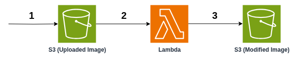

## Table of Content
* [Solution Overview](#solution-overview)
* [Architecture Diagram](#architecture-diagram)
* [Architecture Explain](#architecture-explain)
* [Implementation Record](#implementation-record)

  

# Solution Overview
The Simple Serverless Image Processing solution enables image modification through a simple, cost-effective, and fully managed pipeline.

When a user uploads a new image to cloud storage, the solution automatically generates a resized version with a watermark, then saves the modified copy in a separate storage location, all without manual intervention or the need for dedicated servers.

  

# Architecture Diagram

  

# Architecture Explain

**1.**  The user sends upload image to an **Amazon S3 bucket**.

**2.**  **S3** event notification automatically invokes a **Lambda function** when a new image is uploaded.

**3.**  The **Lambda function** resizes the image (600*600), applies the watermark, and saves the modified copy into another **S3 bucket**.

 

The **Lambda** function is implemented in `Python`, making it lightweight and well-suited for serverless workloads. For image manipulation, it uses the `Pillow` library provided through a **Lambda Layer**, which keeps the deployment package small, modular, and easy to maintain.

The **Lambda Layer** hold `Pillow Library` with the `watermark` image to override the copy image with it

  

# Implementation Record
* [This Video](https://drive.google.com/file/d/1-lXPw-NdqrX-zOhNRG_CDK3qIM1akb69/view) shows the implementation of the solution
* [Implementation](./Implementation/) explain the implementation of record